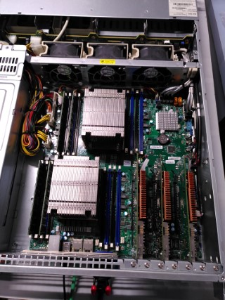
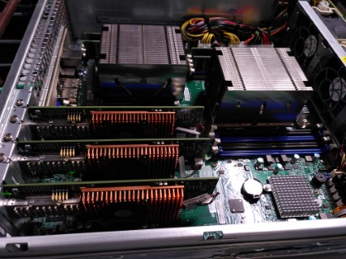

# Introduction
**Easy Portals** is a simplified *Portals* programming API which can be used for initiation to the *Portals* HPC Communication semantic.

The Easy Portals library allows to create up to 16 endpoints that can communicate together with the Portals API. Each endpoint is identified by an integer ID between 0 and 15.

The Easy Portals library is auto-documented in the *ezportals.h* file.

## Context

In High Performance Computing (HPC), simulation and AI training applications are implemented with tasks that execute in parallel on the cores of the servers. This allows to get the maximum compute power of the supercomputers. The counterpart of this is the need to exchange data between the tasks because computations usually depends on other tasks results.
Here comes the interconnect network of the supercomputer. It offers high-bandwidth and low-latency communication features, but it needs specific communication APIs (like *Portals*, *libfabric* or *Verbs*) to benefit from these features.

## Requirements
For building the Easy Portals library and programs using this library, the system must have the *Portals4* library and headers installed.

For execution of programs using Easy Portals library, the system have *BullSequana Exascale Interconnect* (BXI) NIC devices.

## Configuration
The EZP_GROUP environment variable controls the physical interface and Portals PID range that is used by the program. For instance if EZP_GROUP is set to 5, physical interface 1 and Portals PIDs 3100 to 3115 are used by the program.

## Build
To build the project, you must initialize the build environment with `meson setup build`. Then launch the build with `ninja -C build`.

# Challenges
This project proposes an initiation to the *Portals* communication semantic with several coding challenges that are based on the Easy Portals library.
* [Challenge 1](challenge1) : First Portals communication
* [Challenge 2](challenge2) : Climate simulation communications
* [Challenge 3](challenge3) : Broadcast communications

---

### Internals (Not required for using Easy Portals)
The Portals 4.3 Network Programming Interface is available at https://www.sandia.gov/app/uploads/sites/144/2023/03/portals43.pdf.

We assume that all endpoints are running on the same NIC (so they have the same nid). Portals PID is built from endpoint ID (with an offset).

The Portals processes uses physical addressing (PTL_NI_PHYSICAL) and matching (PTL_NI_MATCHING).

There is a single Event Queue per process. There is a single Portals Table Entry per process.

Match entries are always use-once (PTL_ME_USE_ONCE). There is no reception criteria on operation type (PTL_ME_OP_PUT/GET), or on source process (match_id). Matchbit reception criteria is either the exact matchbit value or any matchbit values (EZP_TAG_ANY).

There is a single Counting Event attached to every Match Entries. It is always used as the reference Counting Event for triggered operation. Thus, the threshold specified in the ezpTrigPut() and ezpTrigGet() functions is compared to the number of target data transfer events (PUT/GET).
