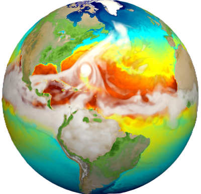

# Challenge #2

In this challenge, you are going to **program the network communications of a climate simulation application**. The application is distributed over several compute tasks and 1 visualization task. The compute tasks iterate over the steps of climate model, each step producing a result for a cell of the mesh representing the earth. At the end of a step, the compute task transmits the results of the cell it worked on to the visualization task for rendering.

Cell processing is unordered and results are transmitted without any synchronization between compute tasks. However, the visualization task expects the cell results to be ordered in its whole mesh buffer for a correct rendering.

Functions related to cell management are provided in a `challenges` library. See `utils/challenges.h` file for the API definition.

For the compute tasks, each iteration step consists in:
* get the id of the next cell to process - `get_next_cell()`
* compute the result for that cell into a pre-allocated buffer - `process_cell()`
* transmit the result to the visualization task
* repeat untill all the cells have been processed

For the visualization task, it consists in:
* prepare for the reception of cell processing result buffers
* start rendering of the whole mesh result - `start_rendering()`
* upon notification of reception events, regularly render the mesh result - `render_cells()`
* when all expected completions have occured, end rendering - `end_rendering()`

### Notes
Program must be launched from the root directory of the repository to correctly access input data

Entire rendering of the image result requires a terminal with 400 characters width and 200 characters height

Hit the 'q' key to quit the `end_rendering()` function, and type `tput reset` to reset your terminal if needed.

